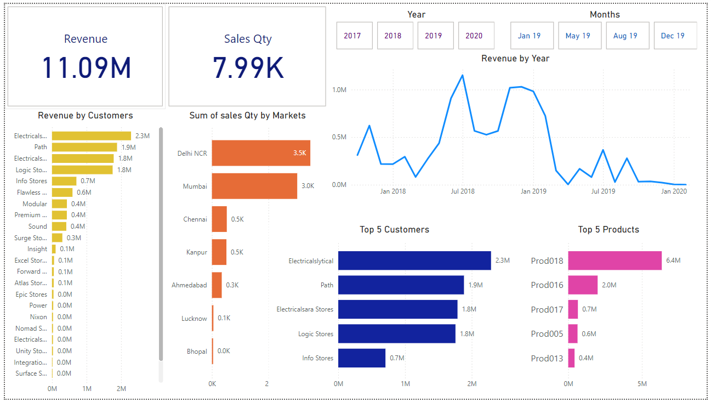

## Sales Insights Data Analysis Project for ATLIQ Hardware Company

Atliq, a computer hardware business, is struggling to keep up with the challenges of a rapidly evolving market. The lack of real-time visibility into sales performance hinders informed decision-making and strategic planning. To address this, I worked on a an interactive and dynamic Power BI dashboard that provides real-time sales insights. This solution aims to empower Atliq to adapt quickly to market trends, optimize sales strategies, and improve overall business performance.

Data Analysis Using Power BI
============================

